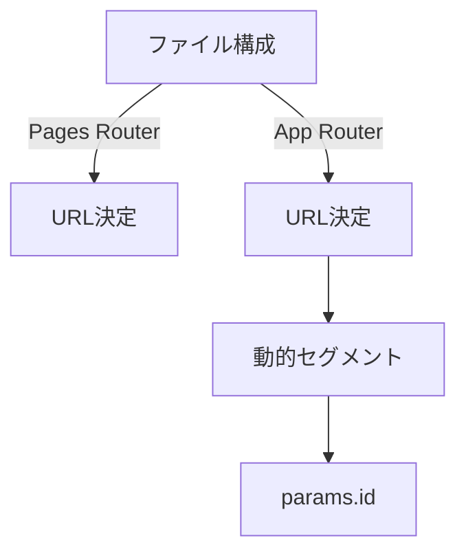

## Next.js 2つのルータの違いを理解するための基礎知識

✨✨✨✨✨✨✨✨✨✨✨✨✨✨✨✨✨✨✨✨✨✨✨✨

https://www.youtube.com/@tech-trend-zunda-metan/featured

最新ツール・トレンド情報をずんだもん×めたんが解説するYouTubeチャンネルを運営しています！
いいね、チャンネル登録してもらえると嬉しいです🙇‍♂️

---

ハジメル.dev: https://hajimeru-dev.vercel.app/

「ひとりで続けるのは難しい」「何から学べばいいか分からない」という方向けに、
プログラミングのマンツーマンレッスンサービス「ハジメル.dev」も運営しています。
未経験OK・オンライン完結・月額制/違約金なしなので、気軽に無料相談してみてください🙇‍♂️

---

海外テックニュースを追いたいけど、英語や情報量の多さで大変…という方向けに、
Hacker News の話題を日本語でサクッと追える「HackerNews 日本語まとめ & AI要約」 
を個人開発しました！
技術トレンド収集に使ってもらえると嬉しいです🔥🙇‍♂️
→ HackerNews 日本語まとめ & AI要約: https://hn-matome-2ht.pages.dev/


---

https://unityroom.com/games/nyampire_survivors

「ニャンパイアサバイバー」というヴァンパイアサバイバーリスペクトのゲームを作成しました！
もしよろしければ遊んで頂けると嬉しいです😭

---

習い事教室の先生向けに、SNS 投稿・生徒募集・保護者通知の文章を AI で生成する Web サービス「おしらせAI」を個人開発しました。Next.js + Supabase + LLM で構成しており、無料で月 10 回まで試用できます。よければ触ってみてください。

→ おしらせAI: https://oshirase-ai.vercel.app/

✨✨✨✨✨✨✨✨✨✨✨✨✨✨✨✨✨✨✨✨✨✨✨✨

### なぜルーターが2つあるのか？  
Next.js 13以降で導入された**App Router**と従来の**Pages Router**は、ファイルベースのルーティングを拡張するための新システムです。  
- **Pages Router**：ファイル名からURLが決まる静的ルーティング（例：`pages/about.js` → `/about`）  
- **App Router**：ディレクトリ構造で動的ルーティングを実現（例：`app/page.js` → `/`、ネストディレクトリで階層構成）  



### 実践的な選択肢：どのルーターを使うべき？  
1. **App Routerを選ぶ条件**  
   - サーバーコンポーネントを使用する必要がある  
   - 複雑な動的ルートが必要（例：ブログ記事のIDベースURL）  
   - サーバーサイドの状態管理が必要な際  

2. **Pages Routerを選ぶ条件**  
   - サーバーコンポーネント不要  
   - シンプルな静的ルート構成  
   - レガシー企業での継続メンテナンス  

## サーバーコンポーネントとクライアントコンポーネントの使い分け  

### コンポーネントの基本形  
```jsx
// サーバーコンポーネント（デフォルト）
export default function Home() {
  return <div>サーバーサイドでレンダリング</div>;
}

// クライアントコンポーネント（指定）
export default function Counter() {
  return <div>クライアントサイドで動作</div>;
}
```

### パフォーマンス最適化のカギ  
| シナリオ                     | 推奨コンポーネント | 理由                                                                 |
|-----------------------------|--------------------|----------------------------------------------------------------------|
| フォームのリアルタイム検証 | クライアントコンポーネント | DOM操作やイベントリスナーが必要                                   |
| データベース接続           | サーバーコンポーネント | セキュリティ上クライアントサイドは危険                            |
| サードパーティライブラリ  | クライアントコンポーネント | npmパッケージのほぼすべてがクライアント専用                     |

### エラー例と回避策  
```jsx
// ❌ サーバーコンポーネントで禁止されている操作
export default function ClientComponent() {
  useEffect(() => { /* サーバーコンポーネントでエラー */ }, []);
}

// ✅ クライアントコンポーネントへの切り替え
export default function ClientComponent() {
  useEffect(() => { /* 正常に動作 */ }, []);
}
```

## サーバーコンポーネントで躊躇する人のためのチェックリスト  

### 採用前の確認項目  
1. **セキュリティリスクの検証**  
   - クライアントサイドで処理されるべき機密データは存在しないか  
   - APIキーや認証情報が漏洩しないか  

2. **依存関係の確認**  
   ```bash
   # Next.js 14以降の自動変換対応ライブラリ
   npm list @react-three/fiber
   ```

3. **パフォーマンスメリットの確認**  
   - データベース接続やファイルシステム操作が必要なケースか  
   - SSR（Server-side Rendering）の必要性  

### よくある失敗事例  
- **不要な変換によるエラー**  
  ```bash
  # エラー発生例
  npm install @react-three/fiber
  # サーバーコンポーネントで使用 → コンパイルエラー
  ```

- **過剰なサーバーコンポーネント化**  
  ```jsx
  // 不要なAPI呼び出し
  export default function Header() {
    const { data } = await fetch('/api/user'); // ネットワーク使用が不要
    return <div>{data.name}</div>;
  }
  ```

## まとめ：実務で役立つNext.jsの基本ステップ  

### 3つのポイントで進めるNext.js活用  
1. **ルーター選定の優先順位**  
   - サーバーコンポーネントが必要 → App Router  
   - シンプルな静的ページ → Pages Router  

2. **コンポーネントの選択フロー**  
   ```mermaid
   graph LR
   A[コンポーネント作成] --> B{サーバーサイド処理必要か？}
   B -->|はい| C[サーバーコンポーネント]
   B -->|いいえ| D[クライアントコンポーネント]
   ```

3. **段階的な実装戦略**  
   1. Pages Routerで基本機能を確認  
   2. App Routerに徐々に移行  
   3. サーバーコンポーネントを特定のコンポーネントに限定  

### 実務で必須のチェック項目  
- [ ] サーバーコンポーネントのセキュリティ確認  
- [ ] クライアントコンポーネントのDOM操作依存性検証  
- [ ] ルーター間のデータ共有方法の確認  

```bash
# 開発環境の確認コマンド
npm run dev -- --router app
```

この記事を実践することで、Next.jsの複雑なコンテンツを短時間で理解し、実際のプロジェクトで自信を持って活用できるようになります。
